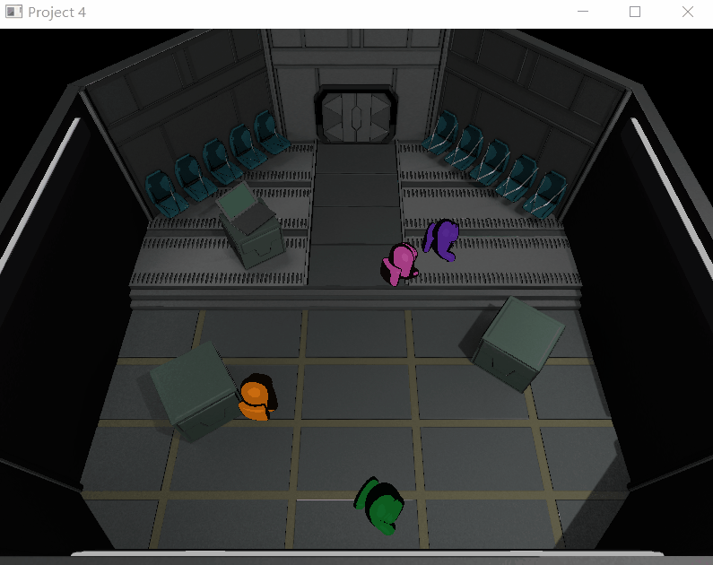

Amoung Us Lobby
---------------

[Amoung us](https://www.youtube.com/watch?v=PnjZiHQjmG4) is a interesting game. This is an implementation of the lobby by OpenGL.  

There several features:
* Texture rendering
* Scene graph
* Toon shader
* Particle effect
* Collision detection

All techniques can be found in detail in the best OpenGL tutorial [learnopengl](https://learnopengl.com/).

Usage
-----

There is an exe compiled on Windows 10 using Visual Studio 2019. If you have trouble to compile by yourself, see learnopeng [Get Started](https://learnopengl.com/Getting-started/OpenGL).  
